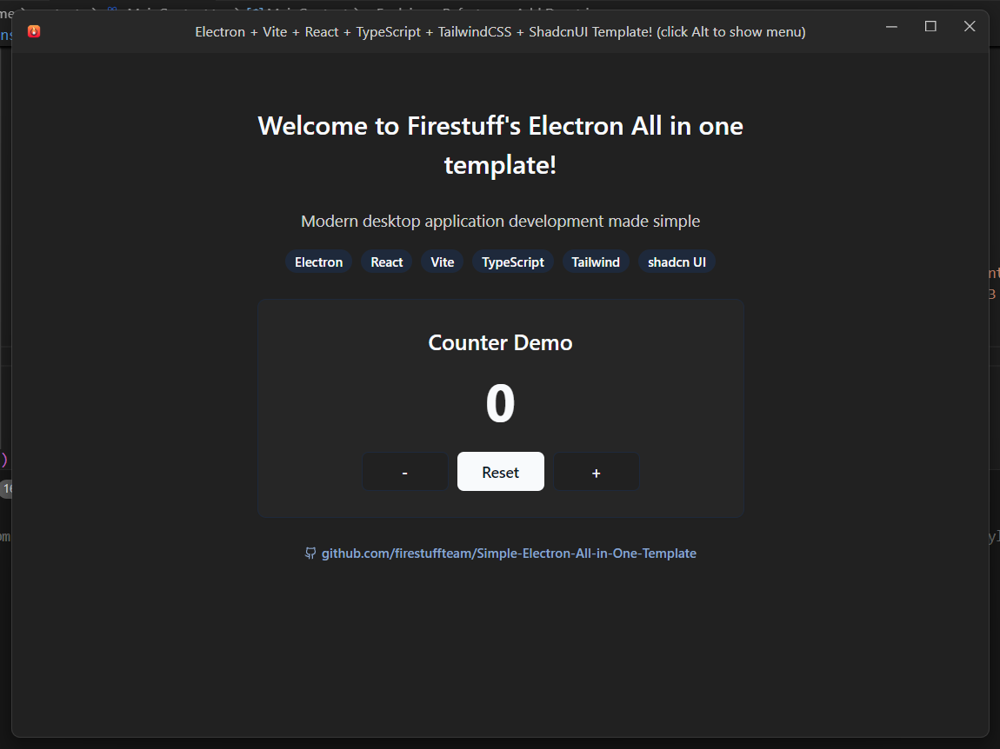

# Firestuff's Simple Electron All-in-One Template

🚀 A powerful and well-structured Electron boilerplate that integrates **React, Vite, TailwindCSS, ShadCN, and TypeScript** out of the box. This template is designed to provide an efficient and scalable starting point for building modern Electron apps.



## ✨ Features

- **Electron + React + Vite** – Lightning-fast development experience.
- **TailwindCSS (Old Version)** – More stable and widely preferred.
- **ShadCN UI Components** – Clean and modern UI components.
- **Custom Window Implementation** – Includes a custom titlebar and menu.
- **Pre-configured ESLint & Prettier** – Enforced clean and consistent code.
- **Well-Structured Codebase** – Organized folders for easy navigation.
- **TypeScript Support** – Fully typed for better maintainability.

## 🖥️ Custom Window Components

This template includes a custom window implementation with:

- **Custom titlebar** with app icon
- **Window control buttons** (minimize, maximize, close)
- **Menu system** with keyboard shortcuts
- **Dark/light mode toggle**
- **Cross-platform support** for Windows and macOS

### 🎛️ Titlebar Menu Toggle

The titlebar menu can be toggled using:

- **Windows:** Press the `Alt` key
- **macOS:** Press the `Option (⌥)` key

#### How It Works:
- If the menu is **hidden**, pressing the toggle key makes it **visible**.
- If the menu is **already visible**, pressing the toggle key **hides** it.
- The menu only toggles if menu items are available.

### 🛠️ Customizing Menu Items

To add, remove, or modify menu items, update the `lib/window/titlebarMenus.ts` file.

## 📁 Project Structure

```
├── app/                        # Renderer process files
│   ├── assets/                 # Static assets (images, fonts, etc.)
│   ├── components/             # React components
│   │   ├── App.tsx             # Main Application component
│   ├── styles/                 # Styling files (CSS & Tailwind)
│   │   ├── app.css             # App stylesheet
│   │   ├── globals.css         # Global styles
│   │   └── tailwind.css        # Tailwind stylesheet
│   ├── index.html              # Entry HTML file
│   └── renderer.tsx            # Renderer process entry point
├── lib/                        # Shared library code
│   ├── main/                   # Main Electron process files
│   │   ├── index.ts            # Electron entry point
│   ├── preload/                # IPC preload scripts
│   │   ├── index.ts            # Preload entry point
│   │   └── api.ts              # Exposed API for renderer
│   ├── welcome/                # Welcome components
│   └── window/                 # Custom titlebar & menu
├── resources/                  # Build resources
├── .eslintrc                   # ESLint configuration
├── .prettierrc                 # Prettier configuration
├── electron-builder.yml        # Electron builder config
├── electron.vite.config.ts     # Vite configuration
├── package.json                # Dependencies & scripts
├── tailwind.config.js          # Using the old version for stability
├── postcss.config.js           # PostCSS configuration
├── tsconfig.node.json          # TypeScript config for main process
├── tsconfig.web.json           # TypeScript config for renderer
```

## 🚀 Getting Started

### 1️⃣ Clone the Repository
```sh
git clone https://github.com/firestuffteam/Simple-Electron-All-in-One-Template.git
cd Simple-Electron-All-in-One-Template
```

### 2️⃣ Install Dependencies
```sh
yarn install  # or npm install
```

### 3️⃣ Start Development Server
```sh
yarn dev  # or npm run dev
```

### 4️⃣ Build for Production
```sh
yarn build  # or npm run build
```

## 📜 License
This project is **open-source** under the MIT License. Feel free to modify and use it for your projects!

---

🔥 Made with ❤️ by Firestuff
